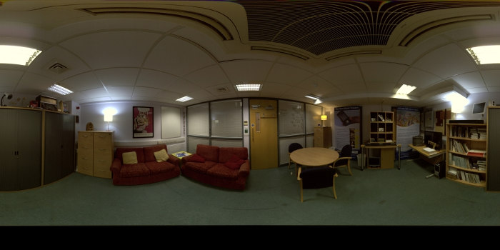
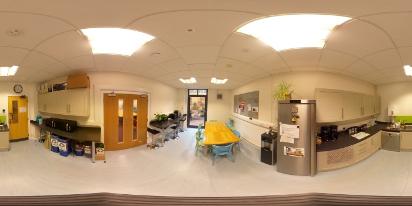
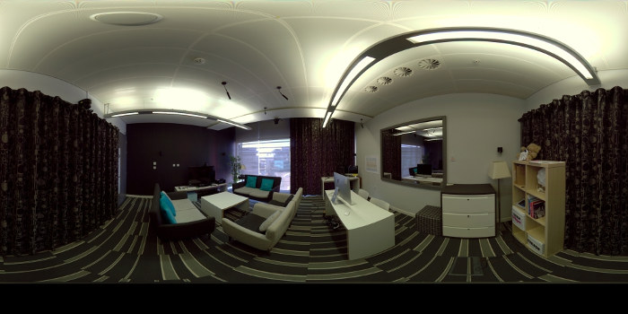
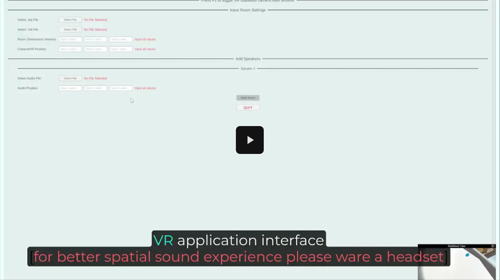

# Results
Original sound sources were recorded in an anechoic environment. Speech from the TIMIT dataset [3] and Music (clarinet) from the OpenAirLib library [4] used for sound rendering. 
1. Music:
[Music Audio](Music-Org.mp3)

2. Speech:
[Speech Audio](Speech-Org.mp3)

## Meeting Room (MR)

### Audio Rendering Music: 
1. Ground-truth  
    
     
3. Rendering with Kim19 [1]  
    
   
4. Rendering with Kim20 [2]  
   
    
5. Rendering with the Proposed Method  
    
    
### Audio Rendering Speech: 
1. Ground-truth   
    
   
3. Rendering with Kim19 [1]  
    
  
4. Rendering with kim20 [2]  
    
   
5. Rendering with the Proposed Method  
   

## Kitchen (KT)

### Audio Rendering Music:
1. Ground-truth  
   [KT-Music-GT Audio](Kitchen(KT)/KT-Music-GT.wav)
     
2. Rendering with Kim19 [1]  
   [KT-Music-Kim19 Audio](Kitchen(KT)/KT-Music-Kim19.wav)
   
3. Rendering with Kim20 [2]  
   [KT-Music-Kim20 Audio](Kitchen(KT)/KT-Music-Kim20.wav)
    
4. Rendering with the Proposed Method  
   [KT-Music-Ours Audio](Kitchen(KT)/KT-Music-Ours.mp3)
    
### Audio Rendering Speech: 
1. Ground-truth  
   [KT-Speech-GT Audio](Kitchen(KT)/KT-Speech-GT.wav)
   
3. Rendering with Kim19 [1]  
   [KT-Speech-Kim19 Audio](Kitchen(KT)/KT-Speech-Kim19.wav)
   
4. Rendering with Kim20 [2]  
   [KT-Speech-Kim20 Audio](Kitchen(KT)/KT-Speech-Kim20.wav)
   
5. Rendering with the Proposed Method  
   [KT-Speech-Ours Audio](Kitchen(KT)/KT-Speech-Ours.mp3)

## Usability (UL)

### Audio Rendering Music: 
1. Ground-truth  
   [UL-Music-GT Audio](Usability(UL)/UL-Music-GT.wav)
     
2. Rendering with Kim19 [1]  
   [UL-Music-Kim19 Audio](Usability(UL)/UL-Music-Kim19.wav)
   
3. Rendering with Kim20 [2]  
   [UL-Music-Kim20 Audio](Usability(UL)/UL-Music-Kim20.wav)
    
4. Rendering with the Proposed Method  
   [UL-Music-Ours Audio](Usability(UL)/UL-Music-Ours.mp3)
    
### Audio Rendering Speech:
1. Ground-truth  
   [UL-Speech-GT Audio](Usability(UL)/UL-Speech-GT.wav)
   
3. Rendering with Kim19 [1]  
   [UL-Speech-Kim19 Audio](Usability(UL)/UL-Speech-Kim19.wav)
   
4. Rendering with Kim20 [2]  
   [UL-Speech-Kim20 Audio](Usability(UL)/UL-Speech-Kim20.wav)
   
5. Rendering with the Proposed Method  
   [UL-Speech-Ours Audio](Usability(UL)/UL-Speech-Ours.mp3)

---
# VR Real-Time Application Demo

---
## References
[1] H. Kim, L. Remaggi, P.J. Jackson, and A. Hilton, “Immersive spatialaudio reproduction for vr/ar using room acoustic modelling from 360 images,” in Proc. IEEE VR, 2019. 
[2] H. Kim, L. Remaggi, A. Dourado, T. de Campos, P.J.B. Jackson and A. Hilton, “Immersive Audio-Visual Scene Reproduction using Semantic Scene Reconstruction from 360 Cameras,” Virtual Reality, 2022. 
[3] J.S. Garofolo, L.F. Lamel, W.M. Fisher, J.G. Fiscus, D.S. Pallet, and N.L. Dahlgren, “DARPA TIMIT acoustic phonetic continuous speechcorpus CDROM,” NIST Interagency, Tech. Rep., 1993. 
[4] K. Brown, M. Paradis, and D. Murphy, “Openairlib: A javascript libraryfor the acoustics of spaces,” in Audio Engineering Society Convention 142, May 2017. [Online]. Available: http://www.aes.org/e-lib/browse.cfm?elib=18586
